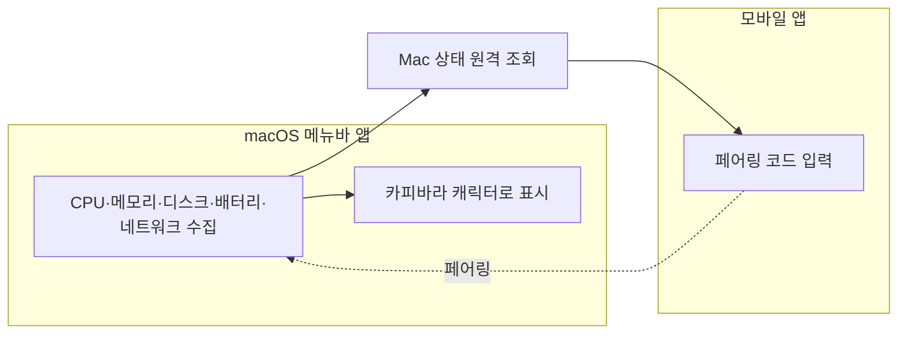
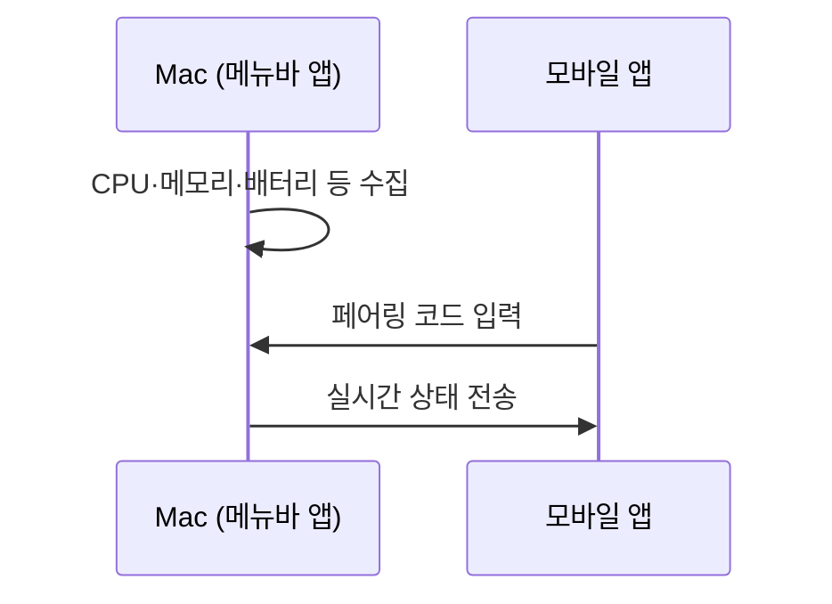

# Capybite — 카피바라와 함께하는 시스템 모니터

- Mac App Store: [apps.apple.com](https://apps.apple.com/kr/app/capybite/id6791479858?mt=12)
- iOS App Store: [apps.apple.com](https://apps.apple.com/kr/app/capybite-mobile/id6791978586)
- Google Play: [play.google.com](https://play.google.com/store/apps/details?id=com.capybite.app&hl=ko)
- 개인정보처리방침: [capybite.sanglimsoft.com/privacy](https://capybite.sanglimsoft.com/privacy)
- 고객지원: [capybite.sanglimsoft.com/support](https://capybite.sanglimsoft.com/support)

**Capybite**는 macOS 메뉴바에 상주하며 CPU·메모리·디스크·배터리·네트워크 사용량을 카피바라 캐릭터로 귀엽게 보여주는 시스템 모니터입니다. 모바일 앱과 페어링하면 자리를 비운 사이에도 내 Mac 상태를 원격으로 확인할 수 있습니다.

## 어떻게 동작하나요

### 이용 흐름

## 이런 분께 추천합니다

- 딱딱한 숫자 그래프보다 직관적인 시스템 모니터를 원하는 분
- 자리를 비운 동안에도 내 Mac 상태를 확인하고 싶은 분

## 주요 기능

- 메뉴바 상주형 실시간 시스템 리소스 모니터링
- 모바일-데스크톱 페어링을 통한 원격 상태 조회
- 실행 중인 프로그램 확인
